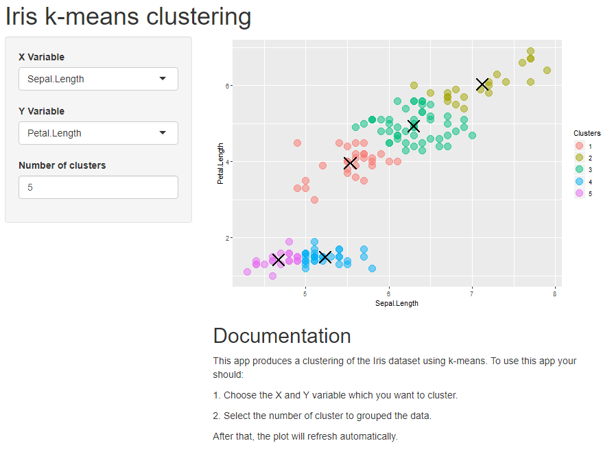

```{r setup, include=FALSE}
knitr::opts_chunk$set(echo = FALSE)
```
## Summary
This app produces a clustering of the Iris dataset using k-means. To use this 
app you should:

1. Choose the X and Y variable which you want to cluster.
2. Select the number of cluster to grouped the data.
After that, the plot will refresh automatically.

Therefore, in this presentation we will show the code for the ui.R and server.R 
scripts of the shiny app. Finally, we will show a capture of the app UI.

## **ui.R** script {.smaller}

```{r, echo=TRUE, eval=FALSE}
library(shiny)

shinyUI(pageWithSidebar(
    headerPanel('Iris k-means clustering'),
    sidebarPanel(
        selectInput('xcol', 'X Variable', names(iris)),
        selectInput('ycol', 'Y Variable', names(iris),
                    selected=names(iris)[[3]]),
        numericInput('clusters', 'Number of clusters', 5,
                     min = 1, max = 9)
    ),
    mainPanel(
        plotOutput('plot1'),
        h2("Documentation"),
        p("This app produces a clustering of the Iris dataset using k-means. 
          To use this app you should:"),
        p("     1. Choose the X and Y variable which you want to cluster."),
        p("     2. Select the number of cluster to grouped the data."),
        p("After that, the plot will refresh automatically.")
    )
))

``` 
## **server.R** script {.smaller}
```{r, echo=TRUE, eval=FALSE}
library(shiny)
library(ggplot2)

shinyServer(function(input, output, session) {
    selectedData <- reactive({
        iris[, c(input$xcol, input$ycol)]
    })
    
    clusters <- reactive({
        kmeans(selectedData(), input$clusters)
    })
    
    output$plot1 <- renderPlot({
        palette(rainbow(9))
        centers=as.data.frame(clusters()$centers)
        par(mar = c(5.1, 4.1, 0, 1))
        g <- ggplot(selectedData(), aes(selectedData()[,1], selectedData()[,2], 
                                        col=as.factor(clusters()$cluster)))
        g + geom_point(size=5, alpha=0.5) + 
            geom_point(data=centers, shape = 4, size=7, stroke = 1.5, 
                       aes(centers[,1], centers[,2]), color = "black")  +
            labs(x=names(centers)[1], y=names(centers)[2], color="Clusters")
    })
})
```
## User interface {.smaller}
```{r, echo=FALSE,  out.width = '80%'}

```
